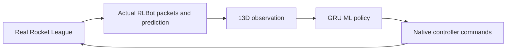

# V13 · Participant starter kit

> **FIRST-TIME SETUP IS REQUIRED IN EVERY EXTRACTED COPY.**
> Read [START_HERE.txt](START_HERE.txt), run **`setup.ps1` from that extracted
> folder**, and wait for **"Setup complete"** BEFORE adding `bot.toml` to RLBot GUI.
> The ZIP excludes `.venv`: without setup, Rocket League may open but **V13 cannot launch**.

**Easiest setup:** extract the ZIP, open the inner `V13` folder, double-click
**`SETUP.cmd`**, and wait for success. **`CHECK.cmd`** runs local checks afterwards.

**A real machine-learning bot for 1v1 Rocket League, launched through RLBot v5.**

Start with the working GRU policy, make a separate upgrade, and test and submit it
through the same ordinary GUI workflow the organisers use.

## Start here

1. [Install and play](docs/QUICK_START.md)
2. [Understand and improve the ML bot](docs/IMPROVING_THE_BOT.md)
3. [Observation, actions and memory](docs/CONTRACT.md)
4. [Test and troubleshoot](docs/TESTING.md)
5. [Package your submission](docs/SUBMISSION.md)
6. [Organiser setup and acceptance](docs/ORGANISER_GUIDE.md)
7. [Original scripted example](reference/python_example/README.md)
8. [Attribution and limits](docs/PROVENANCE.md)



## What is included?

| Path | Purpose |
|---|---|
| `bot.toml` | Register this file in RLBot GUI to play **V13** |
| `setup.ps1` | Create a local Python environment and install pinned dependencies |
| `SETUP.cmd` / `CHECK.cmd` | Double-click setup / local verification |
| `model/V13.pt` | Original trained student weights |
| `src/` | Editable Python inference, observations, policy and native RLBot integration |
| `tools/kit.py` | Verify integrity, create an upgrade copy, seal same-architecture weights, make a clean ZIP |
| `docs/` | Participant and organiser instructions |
| `reference/python_example/` | Separate original scripted bot; useful for understanding RLBot |
| `participant_manifest.json` + `.sha256` | Exact distributable-file hashes |
| `candidate_manifest.json` | Runtime checksums and feature order; required by inference |

The starter is **13 → Linear(64) → ReLU → GRU(64) → 5 outputs**, with 26,181
parameters. Four outputs predict an action mode; one predicts continuous steering.
The supplied student is experimental: basic chasing is learned, but steering and
jump/flip timing have known weaknesses. It is a starting point, not a strong-bot promise.

This kit contains **no demonstration dataset, training runner, local virtual environment,
personal match recordings, research repositories or teacher fallback** in its ZIP.
Collecting/retraining a policy is participant development work; setup never trains.
The reference bot is scripted and separate; choosing it in the GUI does not run V13.

## Fast path

Extract the entire kit into a writable folder such as `C:\Bots\V13`.
Install Python 3.12, Rocket League and the **official RLBot v5 launcher**.
In PowerShell:

```powershell
cd 'C:\Bots\V13'
& '.\setup.ps1'
```

Open RLBot using the installed launcher shortcut → Add/Remove → Add File →
`C:\Bots\V13\bot.toml` → assign teams → choose Epic/Steam as appropriate → Start Match.
Do not open the internal `rlbotgui.exe` directly: the launcher starts the server too.

Test the extracted installation in a real GUI match before submitting it.
Setup and numerical checks do not prove gameplay strength or live compatibility
on every computer. See [testing and troubleshooting](docs/TESTING.md).
